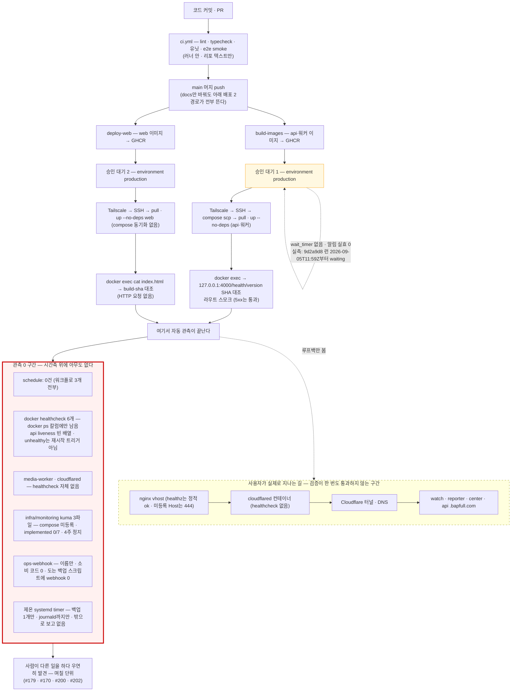
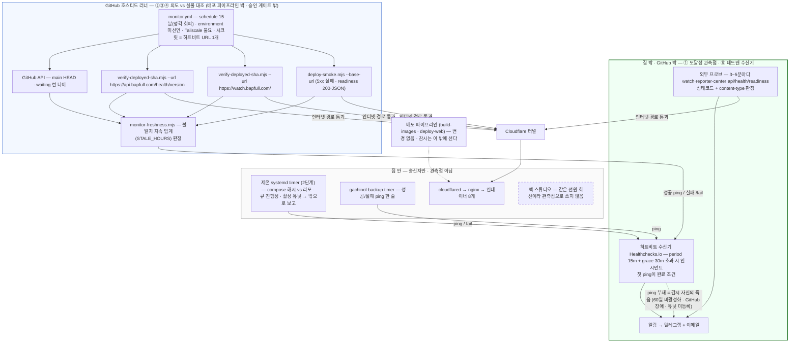

# 근본원인 분석 — 감시가 시간축 위에 없다 (2026-09-06)

> **이 문서의 지위**: [`ROOT-CAUSE-2026-08.md`](ROOT-CAUSE-2026-08.md)의 **자매 문서**다. 그 문서
> §8이 *"개별 결함의 진척은 여기 적지 않는다"*고 이미 못박았고, 191행짜리 문서에 §9를 더 붙이면
> 분량이 두 배가 된다. 그래서 별도 문서로 분리한다.
>
> 둘은 **같은 병의 다른 단면**이다 — 08 문서는 *"검사가 닿지 않는 축에만 결함이 산다"*(공간축:
> 코드의 어느 층을 검사가 통과하지 않는가)를 다뤘고, 이 문서는 *"감시가 시간축 위에 없다"*(시간축:
> 검사가 통과한 뒤에도 그 상태가 계속 유지되는지 아무도 묻지 않는다)를 다룬다. 08 문서 §7의
> 순서표가 "0. 관측 복구 → 1. 도달 경로 자동화 → 2. 검사 범위 확장"까지 다뤘고, 이 문서는 그
> 위에서 반복된 실패(#170·#179·#194·#200·#202)가 **가리키는 다음 축**을 다룬다.
>
> **근거**: 워크플로 `wf_fe316242-d31`(실측 4관점 · 외부조사 4관점 → 후보 16 → 후보별 출처
> 팩트체크 16 · 심사 · 분석 · 계획 2회 · 비평 2회) + 조율자 직접 재실행 10건(§1-0) + **문서 편입
> 시(2026-09-06) implementer 재확인 8건**(§1-0 각주). **모든 수치는 실측이며 재현 명령을 함께
> 적는다**(규율 1) — 기록치는 출처가 아니라 검증 대상이다. 판정 근거의 상세는 각 항의 `파일:행`을
> 직접 열어 확인할 것.
>
> **이 문서는 진단만 담는다.** 해결 계획(슬라이스 S0~S5)·대장 채번(#203~#205 예정)·QUEUE 등재는
> 조율자 발주 아래 별도 트랙(scribe)에서 대장·QUEUE·HANDOFF에 반영한다 — `ROOT-CAUSE-2026-08.md`
> §8과 같은 이유다. 이 문서 §4가 인용하는 `S0`~`S5`·`Q1`~`Q6`은 그 해결 계획의 슬라이스/사용자
> 실행 항목 ID이며, 정의는 이 문서의 범위 밖(QUEUE.md·대장 등재를 참고)이다.

---

## 0. 한 줄 결론 — "어디서 구동하나"에 단일 답은 없다

감시는 **축마다 지점이 다르다.** 판정 기준은 하나 — *관측점이 관측 대상의 고장 모드와 독립인가.*

| 실패 유형(우리가 반복한 것) | 관측점이 있어야 할 곳 | 채택 지점(잠정) |
|---|---|---|
| ① 인터넷 경로 502 며칠 방치(#179) | **집 밖**(제온 안에서는 nginx가 200을 준다) | 외부 SaaS 프로브 |
| ② 이미지 12~24일 스테일(#170) · ③ 배포 2분 뒤 되돌림(#200) · ④ 승인 26시간 방치(#202) | **배포 파이프라인 밖 · 승인 게이트 밖** | GitHub Actions cron(`environment:` 미선언 · Tailscale 불요 · 시크릿 0) |
| ⑤ 스크립트는 있는데 스케줄이 없음(#160 · 감시 설정 자체) | **감시 밖**(오지 않는 것을 보는 주체) | GitHub 밖 하트비트 수신기 |

제온·맥 스튜디오는 **같은 전원·회선**이라 ①의 관측점이 될 수 없다. 이 셋(집 밖 프로브 · 파이프라인
밖 대조 잡 · 감시 밖 수신기)이 서로 대체 불가능하다는 것이 아래 §1·§3의 실측·비교가 도달한 결론이다.

---

## 1. 우리 감시체계 — 실측과 도식

### 1-0. 직접 재실행 (2026-09-06)

아래 11건은 이 진단의 근거가 된 원 실행(조율자, 2026-09-06)이다. 명령은 지금 그대로 다시 돌려
재현할 수 있다.

| 주장 | 명령 | 결과 |
|---|---|---|
| 지금 HEAD ≠ 서빙 | `git rev-parse --short origin/main` / `curl -s https://api.bapfull.com/health/version` / watch `<meta name="build-sha">` | HEAD `9d2a9d8` · api `1776c46` · web `1776c46` |
| 승인 대기 방치 중 | `gh api "repos/HomeDCP/gachinol/actions/runs?status=waiting"` | Build Images · Deploy Web 각 `9d2a9d8`, created **2026-09-05T11:59:40Z** |
| 배포 스모크가 5xx를 통과시킨다 | `grep -n "status === 404" infra/scripts/deploy-smoke.mjs` | `:156 r.error != null \|\| r.status === 404` — 500·502·503은 실패가 아니다 |
| readiness가 인터넷에서 살아 있다 | `curl -o /dev/null -w "%{http_code} %{content_type}" https://api.bapfull.com/health/readiness` | `200 application/json` — 그런데 아무도 안 부른다 |
| liveness는 아무것도 안 잰다 | `grep -n "check(\[" services/api/src/health/health.controller.ts` | `:29 this.health.check([])` 빈 배열 — DB·Redis·S3가 죽어도 200 |
| cron 잡이 승인 게이트를 피할 수 있다 | `gh secret list --env production` / `gh secret list --json name --jq length` | env 시크릿 **0** · 리포 시크릿 8 → 게이트는 `environment:` 선언에만 걸린다 |
| docs만 바꿔도 배포 승인이 뜬다 | `build-images.yml` `on.push` | `branches: [main]`만 — paths 필터 없음 |
| 공개 리포 | `gh repo view --json isPrivate` | `false` |
| GitHub schedule 제약 | WebFetch docs.github.com events-that-trigger-workflows | "once every 5 minutes" · "can be delayed during periods of high loads … some queued jobs may be dropped" · "public repository … automatically disabled … 60 days" · "run on the latest commit on the default branch" · "run in UTC" |
| GitHub 알림 수신자 | WebFetch docs.github.com notifications-for-workflow-runs | "sent to the user who initially created the workflow" · cron 수정자/재활성화자로 바뀜 |
| Healthchecks 실패 신호 | WebFetch healthchecks.io/docs/signaling_failures | "append either /fail or /{exit-status}" · "exit status 0 as success and all non-zero values as failures" |

> **편입 시 재확인(2026-09-06, implementer)** — 위 11건 중 로컬 grep·`gh` CLI·공개 HTTPS 접근으로
> 재실행 가능한 **8건**(HEAD/서빙 SHA 3종·waiting 런·deploy-smoke 판정식·readiness 상태코드·liveness
> 빈 배열·env/repo 시크릿 개수·build-images 트리거·리포 공개 여부)을 이 문서 작성 직전에 다시
> 실행했다. **전건 원문과 정확히 일치, 어긋난 값 0건**(HEAD·waiting 런 생성 시각까지 그대로 —
> 즉 이 문제는 계획 작성 이후로도 **아직 해소되지 않은 채 진행 중**이다). WebFetch 3건(GitHub
> schedule·알림, Healthchecks 신호)은 이 환경에 WebFetch 도구가 없어 재실행하지 않고 원 실행
> 결과를 그대로 옮긴다.

### 1-1. 구조 — 무엇이 언제 확인되고, 어디서부터 아무도 안 보는가

자동 검사는 **두 순간**에만 켜진다.

1. **코드를 올릴 때** — PR·main 머지마다 `ci.yml`이 lint·typecheck·유닛·e2e smoke·파괴적
   마이그레이션 게이트를 **리포 텍스트 기준**으로 본다. 러너 안의 프로세스만 본다.
2. **배포 직후 딱 1회** — 사람이 승인 버튼을 누르면 러너가 Tailscale로 제온에 SSH → 컨테이너
   교체 → **그 컨테이너 안에서 자기 자신(127.0.0.1)에게** "너 어느 커밋이니"를 묻고 라우트 4개가
   404가 아닌지 본다. web은 HTTP 요청조차 없이 `docker exec cat index.html`이다.

이 검사들은 **nginx·cloudflared·Cloudflare 터널·DNS·인터넷을 한 번도 지나지 않는다.** 워크플로
주석이 스스로 적었다 — *"러너→제온 직접 HTTP 가능 여부는 미실측이라 이미 확립된 SSH 경로를
재사용한다"*(`build-images.yml:276`, 편입 시 재확인). 즉 **사용자가 실제로 지나는 길은 검사
경로 밖**이다.

그리고 그 검사가 끝난 다음 순간부터는 **아무도 보지 않는다.** 워크플로 3개(`ci.yml`·
`build-images.yml`·`deploy-web.yml`, 편입 시 `ls .github/workflows/*.yml` 재확인) 어디에도
`schedule:`이 없다(편입 시 재확인: `grep -rn "schedule:" .github/workflows/*.yml` → 0건).
제온에서 주기적으로 도는 gachinol 유닛은 백업 타이머 1개뿐이다(§1-4). 남는 것은 docker
healthcheck인데 결과가 `docker ps` 칼럼에만 남고 어디로도 보고되지 않으며, 재는 것도 "프로세스가
떠 있다" 수준이다. 인터넷 경로의 마지막 홉인 **cloudflared와 media-worker는 healthcheck 자체가
없다**(편입 시 재확인: `infra/docker/docker-compose.xeon.yml`의 `cloudflared:`·`media-worker:`
서비스 블록에 `healthcheck:` 키 0건). 알림 배선은 0이다 — `ops-webhook`은 이름만 있고 소비
코드가 없으며(편입 시 재확인: 리포 전체에서 `UPTIME_KUMA_ALERT_WEBHOOK_URL`·`ops-webhook`을
`infra/monitoring/` 밖에서 참조하는 코드 0건), 실제로 도는 백업 스크립트에는 webhook 호출이
없다(*알림 있는 코드는 안 돌고, 도는 코드는 알림이 없다*).

### 1-2. 자동 검사 전수 — 언제 · 무엇을 · 원리적으로 못 잡는 것

| 검사 | 순간 | 확인 | 못 잡음 |
|---|---|---|---|
| ci.yml 5종(마이그레이션 게이트·lockfile·lint/typecheck·유닛+test:scripts·e2e smoke) | PR·머지 | 리포 텍스트·러너 안 프로세스 | 배포된 것 전부 |
| 이미지 빌드(api·워커 3종) | PR(paths 필터)·머지 | Dockerfile 빌드 가능 | **compose만 바꾼 PR은 아예 안 돈다**(paths에 compose 없음) |
| preflight 게이트 | 머지 직후 1회 | 시크릿·vars가 **비어 있지 않은지** | 값이 옳은지(규율 21) |
| Environment 승인 | 무기한 대기 | 사람 1명 클릭(편입 시 재확인: `environment: production`이 `build-images.yml:177`·`deploy-web.yml:354` 2곳 선언) | **대기 시간을 아무도 안 잰다**(26시간·지금 또) · 두 워크플로 각각 요구(#202) |
| compose scp 동기화 | 배포 직전 | 리포→제온 덮어쓰기 | `docker compose config` 검증 0 · deploy-web엔 이 스텝 없음 |
| SHA 대조 api·워커·web | 배포 직후 1회 | 컨테이너 **안**에서 GIT_SHA | 인터넷 경로 · 라우트가 빠진 이미지 · **1초 뒤** |
| 라우트 스모크 api | 배포 직후 1회 | 4경로 ≠404 + 음성 대조 | **5xx 통과**(`deploy-smoke.mjs:156`) · 인터넷 경로 밖 |
| compose healthcheck 6/8 | 10~30초 반복 | liveness(빈 배열)·nginx 정적 `ok` | **결과가 어디로도 안 감** · unhealthy는 재시작 트리거 아님 · media-worker·cloudflared 없음 |
| `restart: unless-stopped` | 상시 | 프로세스 종료 시 재기동 | 살아서 응답만 못 하는 상태(hang·502) |
| **(부재) 주기 감시** | — | — | 배포 이후 시간축의 모든 것 |

### 1-3. 감시 자산 — 선언 vs 구동

| 자산 | 선언 | 구동 |
|---|---|---|
| `infra/monitoring/uptime-kuma-config.yml` | 내부 모니터 6 + 외부 체크 2 + 채널 ops-webhook | **0** — compose에 kuma 0건(편입 시 재확인: `docker-compose.prod.yml`·`docker-compose.xeon.yml` 양쪽 `grep -n "kuma"` 0건), `pg-backup-freshness implemented:false` |
| `infra/monitoring/uptime-kuma-alerts.json` | 경보 7종(security 4·resource 2·evidence 1 — **가용성 0**) | **0** — `implemented` 7건 전부 false(편입 시 재확인: `grep -c '"implemented": true'` → 0, `grep -c '"implemented": false'` → 7), push 스크립트 0건 |
| `infra/monitoring/log-retention.md` | 증거 보전 파이프라인 | **0** — 스스로 "범위 밖" 선언 |
| `ops-webhook` → `UPTIME_KUMA_ALERT_WEBHOOK_URL` | Slack/Discord 호환 웹훅 | **배선 0** — `.env.example` 공란 + 소비 코드 0(편입 시 재확인, §1-1) |
| `infra/backup/gachinol-backup.timer` | 매일 04:00 | **가동 중**(유일, ops-prober 실측 인용) — 단 알림 0, journal은 adm 그룹 없이 못 읽음 |
| `.github/workflows/*.yml` `schedule:` | — | **0건**(편입 시 재확인, §1-1) |

선언 15개 · 구동 0개. 이 리포의 ROOT-CAUSE-2026-08.md가 지목한 *"계약은 있는데 구동이 없다"*가
감시 자산 그 자체다. `infra/monitoring/uptime-kuma-config.yml`은 자기 파일 안에서 이렇게 적었다
(편입 시 재확인, `:22-27` 인근):

> *"① Uptime Kuma = 제온 "자체"에서 도는 내부 감시자. 제온이 죽으면 Kuma도 함께 죽는다 —
> 그래서 이것만으로는 불충분."*

즉 이 리포가 이미 "제온 안의 감시자는 제온 자신의 죽음을 못 본다"를 **스스로 문서화해 두고도**,
그 문서가 요구한 "② 외부 무료 업타임 체크"를 4주째 개설하지 않았다.

### 1-4. 제온 실측 (ops-prober 실측 인용, 2026-09-06)

⚠️ 아래 항목은 제온 SSH 읽기 전용 접근이 필요해 이 문서를 편입한 implementer가 직접 잰 것이
아니다 — 원 실행(조율자 발주 아래 ops-prober 롤이 수행)의 결과를 그대로 인용한다.

- 컨테이너 8개 전부 `sha-1776c46`(불변 태그). healthy 6 · **health=none 2(media-worker·cloudflared)**.
- 타이머 11개 중 gachinol은 `gachinol-backup.timer` 1개(LAST 04:00, 성공 여부는 journal 권한
  부족으로 **미확인**). 감시·워치독에 해당하는 유닛 **0**.
- `~/gachinol/infra/monitoring/` 3파일 존재(8/21 복사) — 배포된 적 없음.
- 자원 여력: RAM 가용 23Gi/31Gi · 64스레드 load 3 · 디스크 1.8T 가용. **감시 컨테이너를 못 띄울
  이유는 자원이 아니라 관측점 문제다.**
- 잔재: `gachinol-dcp-relay.service`·`gachinol-quick-tunnel.service` 유닛 파일이 남아 있음
  (비활성으로 보이나 enabled 여부 미확인 — 허용 명령 밖).

### 1-5. 사고 이력 — 감시가 있었다면 어디서 잡혔나

| 사고 | 발견 | 지연 | 잡았을 축 |
|---|---|---|---|
| #179 인터넷 502 | 사람(전수 정독) | "며칠"(깨진 시각 미기재) | ① 집 밖 프로브 |
| #170 이미지 12~24일 스테일 | 사람(실기 검증 중) | 12~24일 | ② HEAD vs 서빙 SHA |
| #180 배포된 적 없는 라우트 | 사람(전수 정독) | 9일 | ② + 라우트 스모크 주기화 |
| #194 수동 `up -d`로 옛 이미지 서빙 | 계측기 값을 사람이 대조 | 같은 날 | ② (200만 재면 못 잡음) |
| #200 2분 뒤 되돌림 | 사람(404 관측) | 미기재 | ③ 파이프라인 밖 주기 대조 |
| #202-a 승인 26시간 방치 · 지금 `9d2a9d8` | 사람(UX 질문 중) | 26h · **진행 중**(§1-0 편입 시 재확인) | ④ HEAD≠서빙 지속 |
| #160 백업 스크립트 미가동 | 사람(착수 전 확인) | 미기재 | ⑤ 데드맨 |
| #72 감시 설정 4주 미구동 | 사람(검증자) | 4주 | ⑤ (감시 자신) |
| #161 이미지 3일 미빌드 · #165 Deploy Web 성공 0회 · #156 CI 연속 실패 | 사람(다른 일 하다가) | 3일 · 전 기간 · PR 3개 | 파이프라인 상태 감시(워크플로 단위) |
| #90 큐 전역 정지 · #91 SPA 폴백 200 | 사람(실증 중) | 잠복 전 기간 | 진행성 헬스(2단계) · content-type 판정 |

**패턴 6개**
- ⓐ 발견 주체가 **전부 사람**(기계가 먼저 알린 사고 0건)
- ⓑ 발견 경로가 전부 **부수적**(다른 일을 하다 밟음)
- ⓒ 배포 직후엔 정상이었다가 **그 이후에** 깨짐
- ⓓ **선언은 있고 구동이 없음**(산출물의 존재를 동작의 증거로 착각)
- ⓔ 축이 서로 **대체 불가**(200만 재면 #194·#91, SHA만 재면 #180, 도달·신선도만 재면 #90·#160을 놓침)
- ⓕ **사고를 만든 층 안에 감시를 두면 자기 사고를 못 봄**(#179 제온 안, #200 파이프라인 안, #202 게이트 안)

정본 한계: 17건 중 11건이 `brokeAt` 미기재 — 감지 지연을 수치로 못 잰다. 대장·일간보고에
"언제 깨졌나"를 적는 칸이 없다.

### 1-6. 도식 — 현재

---

## 2. 외부 모범 체계 3 — 조사 방법 · 출처 · 신뢰성

### 2-1. 방법 (지어내지 않기 위해)

1. **4관점 조사** — A 외부 관측점 합성감시(SaaS·자체호스팅·데드맨) / B CI 러너 스케줄 감시 /
   C SRE 원칙·표준 도구 / D 배포 드리프트·신선도. 각 조사자는 URL을 WebFetch로 **실제로 열어
   확인한 사실만** 적도록 했다.
2. **후보 16개 각각 독립 팩트체커**가 모든 keyFact의 URL을 다시 열어 verified / not-found /
   contradicted / unreachable로 판정하고, 출처 유형(공식 문서인지 마케팅 페이지인지)을 정정.
3. **심사** — 사전식: ⓐ 팩트체크 failed면 탈락 ⓑ 우리 실패 유형 ①~⑤ 중 몇 개를 구조적으로
   잡나 ⓒ 1인 운영 부담 ⓓ 비용(무료 우선).
4. **조율자 무작위 재확인** — 핵심 외부 주장 3건을 직접 WebFetch(§1-0의 GitHub schedule·알림·
   Healthchecks 신호 3행).

**신뢰성 등급 기준**: high = 1차 공식 문서(docs.github.com · sre.google · healthchecks.io/docs ·
upptime.js.org/docs · prometheus.io · crazymax.dev/diun). medium = 벤더 가격·마케팅 페이지(값이
바뀌고 판매 유인 있음) 또는 벤더 자료만 있는 것(Portainer). low = 개인 블로그·요약 사이트 —
**사용하지 않았다.**

팩트체크 결과: verified 14 · partial 1(Uptime Kuma — 부재증명 1건) ·
**failed 1(UptimeRobot — 공식 가격표와 정면 모순 → 탈락)**.

### 2-2. 상위 3 체계

#### 1순위 — 축별 2층 조합: 외부 프로브 + GitHub Actions cron 대조 잡(게이트 밖) + 외부 하트비트 수신기

| 층 | 잡는 것 | 어디서 | 근거(검증됨) |
|---|---|---|---|
| 외부 프로브 | ① 502 | 집 밖 SaaS | Better Stack 하트비트/모니터 문서 — *"remains in a Pending state until the first request is received"* [betterstack.com/docs/uptime/cron-and-heartbeat-monitor/](https://betterstack.com/docs/uptime/cron-and-heartbeat-monitor/) (high) · 가격표 Free 열 [betterstack.com/pricing/](https://betterstack.com/pricing/) (medium — 주기·채널 수치가 조사 간 충돌, §4) |
| 대조 잡 | ②③④ HEAD≠서빙 지속 | GitHub 호스티드 러너 | schedule 5분 하한·지연·60일·UTC [docs.github.com events-that-trigger-workflows](https://docs.github.com/en/actions/reference/workflows-and-actions/events-that-trigger-workflows) (high, 조율자 재확인) · 공개 리포 러너 무료 [docs.github.com billing](https://docs.github.com/en/billing/concepts/product-billing/github-actions) (high) · 알림 수신자 규칙 [docs.github.com notifications](https://docs.github.com/en/actions/concepts/workflows-and-actions/notifications-for-workflow-runs) (high, 조율자 재확인) |
| 수신기 | ⑤ 오지 않음 | GitHub 밖 | `/fail`·`/{exit-status}` [healthchecks.io/docs/signaling_failures/](https://healthchecks.io/docs/signaling_failures/) (high, 조율자 재확인) · 무료 20 jobs [healthchecks.io/pricing/](https://healthchecks.io/pricing/) (medium) · 알림 27종(텔레그램 포함) [healthchecks.io/docs/configuring_notifications/](https://healthchecks.io/docs/configuring_notifications/) (high) · 읽기 전용 API 키 [healthchecks.io/docs/](https://healthchecks.io/docs/) (high) |

왜 1순위인가 — 우리 리포 실측이 이 배치를 "새 로직 없이" 가능하게 한다: 대조 로직이 이미
있고(`verify-deployed-sha.mjs`의 `extractSha`, `:35`, 편입 시 재확인 / `deploy-smoke.mjs --base-url`),
시크릿이 전부 리포 수준이라 `environment:`를 선언하지 않는 cron 잡은 #202 게이트에 안 걸리며,
필요한 값(main HEAD·`/health/version`·build-sha)이 전부 공개 인터넷에 있어 Tailscale이 필요
없다. 공개 리포라 러너 비용 0. 감시 정의가 리포에 커밋되므로 #195형(리포↔서버 갈림)이 감시
설정에는 안 생긴다. **GitHub cron이 죽으면(60일 비활성화·고부하 드롭·GitHub 장애) 하트비트
부재로 밖에서 잡힌다** — #72·#160의 "선언만 있고 구동 없음"을 감시 자신에 재생산하지 않는
유일한 장치.

주의(검증됨): GitHub schedule은 정각에 지연·드롭 가능 → 정각 회피 cron. 공개 리포 60일 무활동
시 자동 비활성화. 기본 브랜치 파일만 실행. 스케줄 알림은 워크플로 최초 작성자/cron 수정자에게만
→ **기본 알림을 채널로 쓰지 않는다.** Healthchecks.io FAQ 원문 *"The ops team consists of a
single person, so multi-hour or even multi-day outages are possible"*
[healthchecks.io/faq/](https://healthchecks.io/faq/) — 수신기 자체 SLA 없음.

#### 2순위 — 수신기·프로브 분리형: Healthchecks.io(⑤ 전담) + Upptime(① GitHub Actions 외부 프로브 · 이슈 자동 개폐 · 상태페이지) + 같은 대조 잡

구조는 1순위와 같고 벤더만 다르다. 장점: Upptime은 다운/복구를 **GitHub Issue로 남겨** 정본에
없는 `brokeAt`을 도달성 축에 한해 기계가 기록한다; 텔레그램 알림이 문서화돼 있다
[upptime.js.org/docs/notifications/](https://upptime.js.org/docs/notifications/) (high).
단점: GitHub 의존이 두 워크플로로 늘고(별도 리포 필요), 15분 미만 다운 이슈는 삭제, GitHub
schedule 제약(5분·60일)을 그대로 상속
[upptime.js.org/docs/](https://upptime.js.org/docs/) ·
[faq](https://upptime.js.org/docs/faq/) (high). 비공개 리포로 바꾸면 월 8,640분 이상 소모해
유료화
[docs.github.com minute multipliers](https://docs.github.com/en/billing/reference/actions-minute-multipliers) (high).

#### 3순위 — 코드 없이 붙이는 최소형: 외부 프로브(①) + Healthchecks.io(⑤) + Diun(제온 컨테이너 1개, ② 레지스트리 다이제스트 대조)

Diun은 설정만으로 도는 도구다 — `compareDigest` 기본 true, hc-ping 내장, 알림 17종
[crazymax.dev/diun/](https://crazymax.dev/diun/) ·
[config/watch/](https://crazymax.dev/diun/config/watch/) (high). Watchtower는 2025-12
아카이브·프로덕션 비권장 [github.com/containrrr/watchtower](https://github.com/containrrr/watchtower)
→ 제외. **3순위인 이유(조율자 재판정으로 더 낮아짐)**: 실행 중 컨테이너는 CI가 export한
**불변 태그 `sha-1776c46`**(§1-4)이라 새 빌드가 나와도 그 태그의 다이제스트는 변하지 않는다 —
Diun의 "레지스트리 vs 로컬" 대조는 우리 스테일(#170형)을 **원리적으로 못 잡는다.** 기준은
반드시 "main HEAD vs 서빙 SHA"여야 한다. ③④도 못 잡는다.

### 2-3. 탈락·흡수

- **UptimeRobot** — 팩트체크 **failed**: 조사자의 "무료에 API 없음·2FA 없음" 주장이 공식
  가격표(Free: API ✓·2FA ✓)와 정면 모순. 제품 자체의 결격이 아니라 **미검증 사실을 근거로
  쓸 수 없다**는 규칙으로 탈락. 재조사 가능 후보로 남긴다.
- **Uptime Kuma(자체 호스팅)** — partial. 검증된 사실만으로도 탈락 사유 충분: 리포 파일 자신이
  *"제온이 죽으면 Kuma도 함께 죽는다"*(`uptime-kuma-config.yml`, 편입 시 재확인)라 적었고,
  맥 스튜디오로 옮겨도 같은 집 전원·회선.
- **제온 self-hosted runner** — GitHub 공식: *"Self-hosted runners should almost never be used
  for public repositories"*
  [security-hardening-for-github-actions](https://docs.github.com/en/actions/security-for-github-actions/security-guides/security-hardening-for-github-actions)
  (high) — 우리 리포는 공개(편입 시 재확인: `gh repo view --json isPrivate` → `false`). 관측점 동거.
- **Prometheus+Alertmanager+Blackbox+Watchdog** — 9/9 검증, 표현력 최고. 서버 1대에서는 감시
  스택 자체가 SPOF이고 1인 운영 부담 최대 → **원칙만 흡수**(Watchdog 상시발화 → 외부 수신기
  = ⑤의 정의) [prometheus.io](https://prometheus.io/docs/alerting/latest/configuration/) (high).
- **Google SRE Book ch.6** — 7/7 검증. 원칙으로 전부 흡수: 블랙박스=*"symptom-oriented …
  active—not predicted—problems"*, 화이트박스는 별도 필요(*"for not-yet-occurring but imminent
  problems, black-box monitoring is fairly useless"*), *"Every page should be actionable"*
  [sre.google/sre-book/monitoring-distributed-systems/](https://sre.google/sre-book/monitoring-distributed-systems/) (high).
- **Argo CD·Flux·OpenGitOps·Argo Rollouts·Flagger** — 8/8·4/4 검증, 쿠버네티스 전용 → 원칙(단일
  조정자·지속 조정)만 흡수. **Portainer GitOps** — 벤더 출처만(medium), 배포 주체를 하나 더
  만들어 #200 구조 재현 → 기각.

---

## 3. 근본 한계 — 우리 vs 모범

| # | 근본 한계 | 우리(실측) | 모범은 | 반복된 사고 |
|---|---|---|---|---|
| 1 | **관측이 시간축 위에 없다** — 배포 순간 1회뿐 | `schedule:` 0건 · 배포 후 검증 4종 전부 1회 스텝 · 15:18 통과→15:20 되돌림(#200) | 감시는 *"right now"*를 계속 묻는 것(SRE) · 하트비트는 *"period begins from the first heartbeat"*(Better Stack) | #170 #200 #194 #202 · 지금 `9d2a9d8`(§1-0) |
| 2 | **관측점이 대상과 동거** — 루프백·같은 호스트·같은 전원 | `docker exec … 127.0.0.1` · `cat index.html` · nginx default_server가 200/444 · cloudflared healthcheck 없음 | 블랙박스는 *사용자가 보는 대로 외부에서* · self-hosted runner는 공개 리포에 금지 권고 | #179 #199 #91 |
| 3 | **실행 주체가 없다** — 선언만, 데드맨도 없음 | implemented 0/7 · compose 0 · `.sh` 0 · 4주 정지 · 백업 타이머는 journal까지만 | *"Pending until the first request"* — 등록만으론 아무것도 아님 · `/fail`·exit-status로 실패 신호 | #160 #72 #165 |
| 4 | **알림 수신 배선이 0** — 기존 채널(GitHub 기본 알림)은 실효가 실측으로 부정 | ops-webhook 소비 코드 0 · 알림 있는 스크립트는 안 돌고 도는 스크립트는 알림 없음 · `wait_timer` null(편입 시 재확인) | 스케줄 알림은 작성자에게만(GitHub) · *"Every page should be actionable"* · 채널을 명시 배선 | #156 #161 #165 #202 |
| 5 | **감시 대상이 증상이 아니라 내부 생존·보안** | 경보 7종에 가용성 0 · liveness `check([])` · web `ok` 정적 · 스모크 5xx 통과(`:156`) · 큐 진행성 0 | 블랙박스(증상)+화이트박스(원인) 둘 다 · 상태코드·종료코드로 판정 | #90 #91 #194 #179 |
| 6 | **의도↔실물 조정자가 없다** — 배포 주체 3(두 워크플로+손), 승인 2회, concurrency 독립, HEAD≠서빙을 묻는 주체 0 | `build-images-${ref}` vs `deploy-web-${ref}` · docs-only PR #95도 승인 2건 · `--no-deps`는 한 갈래만 막음 | 기대값 vs 실물을 주기 대조(Diun compareDigest 기본 true) · 단일 조정 루프(GitOps) | #200 #194 #195 #202 |

### 3-1. 어디서 구동해야 하는가 — 후보별 판정

| 후보 | ① 도달성 관측점 | ②③④ 대조 실행 | ⑤ 수신기 | 판정 |
|---|---|---|---|---|
| **GitHub Actions cron**(잠정 선택) | 보조만(GitHub 장애와 상관) | **적격** — 게이트 밖·공개 경로·시크릿 0·비용 0 | 자기 죽음(60일·드롭·장애)을 못 봄 | **②③④ 실행 지점** |
| 제온 systemd timer | #179 반복 | 제온 안에서만 보이는 것(#195 compose 해시·#90 큐·#199 유닛) | 못 봄 | **2단계 송신자** |
| 외부 SaaS 프로브(Better Stack / Upptime) | **적격** | HEAD 대조 로직 없음 | (Better Stack heartbeat 가능) | **① 관측점** |
| 외부 하트비트 수신기(Healthchecks.io) | 수신 전용 | 없음 | **적격** — GitHub 밖·집 밖 | **⑤ 수신기** |
| 맥 스튜디오 launchd | 같은 전원·회선 | 가능하나 이점 0 | 없음 | 쓰지 않음(#199형 미선언 유닛 하나 더) |
| 제온 self-hosted runner | 부적격 | 이점 0 | 없음 | 기각(공개 리포 보안 권고) |
| Diun | – | 불변 태그라 원리적으로 스테일을 못 잡음 | – | 기각 |

### 3-2. 도식 — 목표

---

## 4. 미확인 · 한계 (정직하게)

- **러너 → Cloudflare 도달** — 이 리포에서 한 번도 검증된 적 없음. `pull_request` 트리거로
  **PR에서 처음 실증**된다. 실패하면 그때 Tailscale 합류 또는 Upptime으로 전환한다(설계가 이
  실패를 견딘다).
- **Better Stack 무료 사양이 조사 간 충돌** — 주기 3분 vs 30초, 채널 "Slack·이메일만" vs
  "푸시 포함". 마케팅 페이지라 medium. **가입 전 사용자 화면 확인 필수**(Q2).
- 두 벤더 **무료 티어 상업적 이용 가부** — ToS에 문구 없음 → 운영자 문의.
- `GITHUB_TOKEN`의 `actions: read`만으로 runs API가 되는지 · `gh` CLI 러너 기본 설치 · 공개 리포
  워크플로 로그 공개 범위 — 관행 근거뿐. **PR dry-run 런에서 실증**된다.
- Healthchecks.io가 **상태 전이에서만** 알림하는지(연속 `/fail` 재알림 없음) — "경보 0건" 논리가
  이 전제에 기대나 출처 미확인 → S2 왕복에서 실측.
- GitHub concurrency와 waiting 런 상호작용 — 문서 근거만.
- Cloudflare 플랜·Health Checks 가용성 · 터널 ingress 규칙 — 미확인(설계는 기대지 않는다).
- 제온 `gachinol-backup.service` 성공 여부 — journal 권한 부족. **S5 하트비트가 이 미확인을
  해소한다.**
- 사고 17건 중 11건 `brokeAt` 미기재 — 그래서 S4에서 기록 형식을 신설한다.

---

## 5. 이 문서의 갱신 규칙

- **진단이 바뀌면 갱신한다.** 해결 계획의 진척(S0~S5)은 여기 적지 않는다 — 대장·QUEUE가 원천이다
  (`ROOT-CAUSE-2026-08.md` §8과 같은 규칙).
- §1(실측)이 가리키는 상태가 해소되면 표의 줄을 지우지 말고 **해소 표기**한다 — 재발 여부를
  봐야 한다(예: §1-0 "지금 HEAD ≠ 서빙" 행이 실제로 일치하게 되면 그 옆에 확인 일자를 남긴다).
- 이 문서의 수치를 인용할 때는 **그 자리에서 재실행**한다(규율 1). 이 문서도 예외가 아니다.
